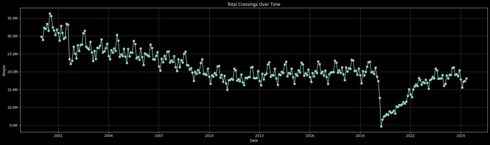

# Conclusions

Border crossings represent one of the most tangible measures of human mobility and economic activities between countries. Each month, millions of crossings are recorder between the US borders with Canada and Mexico. In these numbers are represented the work, travel, visits, and commerce of millions of people. It is the pulse of North America economic dependence.

After retrieving, cleaning, processing, and analysing the data, these are the conclusions that have been reached with respect to each idea.

## Total Trends Over Time

From the following graph, we are able to see the total amount of people crossing the border each month for the last 25 years. During this time period we have seen small and big events that have shaken, not only the US, but the whole world. We can see pre-9/11 world, economic turbulance, policy shifts, unprecedented global events and more. The graph reveal a story that goes far beyond simple statistics. Each change points to something that affected millions of people.

The graph reveals a sort of arc that start going down begining the 21st century and steadied out after 2010. After the years of stability, and even an upwards trend, we see the massive effect of COVID-19. An unprecedented plummet that we are yet to recover from.

While this overview reveals the dramatic scope of border crossing fluctuations over time, it prompts us to wonder about the factors driving these patterns. The following analyses will dive deeper into the specific events that created these disruptions, examine whether certain times of year consistently show higher or lower crossing volumes, see the difference between the two major border regions, Mexico and Canada, contribute differently to overall trends, and identify specific ports. Together, these focused examinations will paint a comprehensive picture of the complex forces shaping North American border mobility.

## Major Events Impacts

## Seasonal Patterns

## Mexico vs Canada

## Top Ports
